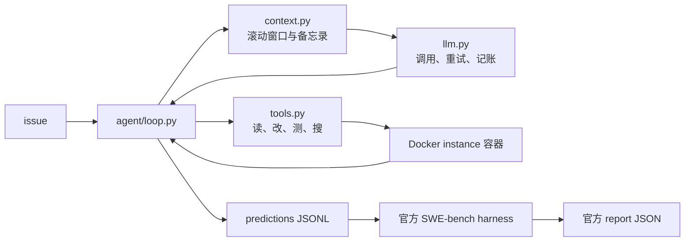

# 从零实现 Coding Agent，并用 SWE-bench 官方 harness 评测

这是一个纯 Python 的实验项目：模型根据 GitHub issue 决定调用工具，程序在对应的 Docker 容器中读代码、编辑文件、运行测试，再把结果交回模型。每例最多 20 轮，最后导出 patch，由 SWE-bench 官方 harness 判卷。项目没有使用 Agent 框架。

## 结果与口径

从 SWE-bench Verified 的 500 例中，按仓库分层、固定 seed=42 抽取 50 例。三轮使用同一份 [`eval/instances_50.json`](eval/instances_50.json)，模型均为硅基流动提供的 `deepseek-ai/DeepSeek-V4-Flash`；结果均来自 `swebench.harness.run_evaluation` 的报告。官方报告和当轮 predictions 已放在 [`results/`](results/README.md)，可重新判卷。

| 版本 | 官方 resolved | 空 patch | 本轮改动 |
|---|---:|---:|---|
| baseline | 20/50（40%） | 25 | 基础 Agent 循环 |
| round 1 | 29/50（58%） | 5 | 工具链修复与行动强制同时上线 |
| round 2 | 30/50（60%） | 3 | 在 round 1 基础上加入上下文备忘录 |

从 baseline 到 round 2 的净变化为 **+10 例、+20 个百分点**。这里的 60% 只适用于固定的 50 例子集，不能与 Verified 全量 500 例的排行榜成绩直接比较。每个配置只做了一次完整的 50 例运行，没有重复实验；round 2 相比 round 1 新解决 3 例、失去 2 例，净增 1 例，不能据此认定备忘录稳定提高了解决率。

round 1 同时修复了新建文件未进入 patch、测试命令无法运行 shell 内建命令，以及 `edit_file` 创建新文件的问题；另加入轮数提示、文字提醒和第 9 轮的 `tool_choice` 强制编辑。本地归档轨迹显示，新增的 9 个 resolved 实例中，有 6 个在强制轮首次编辑。这是行为观察，不能据此拆分强制编辑对总增益的贡献，因为没有单独消融工具修复。round 2 的备忘录未改善它针对的重读指标：`refetch_after_trim` 从 12/50（24%）到 17/50（34%）；配对 McNemar 精确检验约 p=0.30，不能断言指标变差。

基线 30 个未解决实例的归因表由规则初分类与人工复核形成，其中 21 个被归为“读到目标文件但未编辑”。人工复核了 17 个，另外 13 个沿用规则分类；其中仍有 2 个边界案例的归类存在争议。这份归因用于决定迭代方向，不是官方 harness 的失败原因标签。本地 harness 逐例测试明细还显示，破坏已通过测试的实例数从基线 3 个升至 round 1 和 round 2 的 8 个；公开的汇总报告不包含这项细分统计。

本地 token 账本在项目结束时为 **$2.5973**，按配置中的 cache-miss 单价估算并用于成本熔断。这不是供应商账单金额。单例估算上限 $0.40、项目累计上限 $40。

## 实现



- `agent/tools.py` 提供 `read_file`、`edit_file`、`run_tests`、`code_search`。编辑要求旧文本唯一命中；工具调用在对应的 Docker instance 容器中执行。
- `agent/context.py` 截断长工具输出，并保留最近轮次及较早轮次的简短备忘录。
- `agent/llm.py` 记录 token 与估算费用，使用文件锁维护持久账本并执行两级熔断。
- `runner/run_batch.py` 以子进程并发运行实例，支持墙钟超时、清理容器和断点续跑。
- `eval/judge.sh` 只包装官方 `swebench.harness.run_evaluation`；`analysis/triage.py` 的规则分类不参与 resolved 判定。

## 复现

开发环境为 Python 3.11+、Docker Desktop。此项目在 Apple Silicon 上使用官方 x86_64 评测镜像及 Rosetta 模拟；完整 50 例运行会下载较大的镜像，并产生模型 API 费用。依赖版本见 [`requirements.txt`](requirements.txt)。

```bash
python3.11 -m venv .venv
source .venv/bin/activate
pip install -r requirements.txt
python -m pytest

# 零模型费用：用官方 gold patch 验证 5 例判卷链路
bash eval/judge.sh gold gold-smoke-1

# 用已发布的 predictions 重新执行官方判卷，不调用模型 API
bash eval/judge.sh results/predictions_round2.jsonl rejudge-round2
```

运行自己的 Agent 时，将 `SILICON_KEY` 放入环境变量或不入库的 `.env`，然后执行 `python -m runner.run_batch --tag my-run`，最后用 `bash eval/judge.sh logs/predictions_my-run.jsonl my-run` 判卷。可在 [`config.py`](config.py) 中选择其他 OpenAI 兼容端点；切换模型或供应商后不能把新结果与上表混称为同一实验。

阅读示例：[成功案例](examples/success_django__django-12304.md)和[失败案例](examples/failure_sphinx-doc__sphinx-10673.md)。它们用于理解轨迹与失效模式，汇总数字以 `results/` 中的官方报告为准。

## 项目边界

这是一套固定基准上的研究性实现，尚未做独立多次重复实验或拆分 round 1 的消融实验。公开的 predictions 可以重新判卷；重新调用模型不保证生成同一批 patch。项目已收尾，保留这些限制作为结果的一部分。
